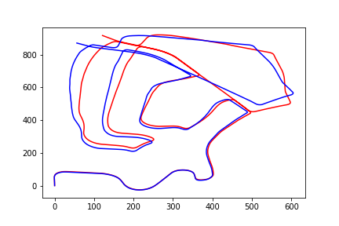
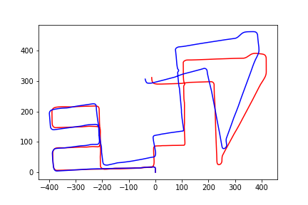
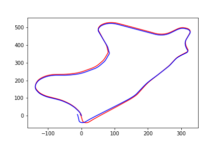
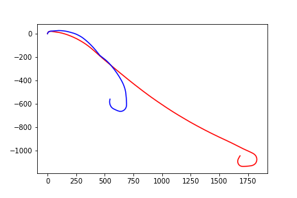
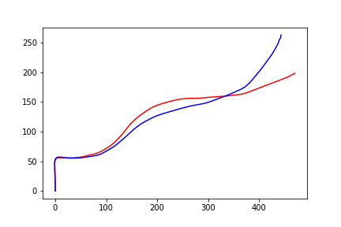
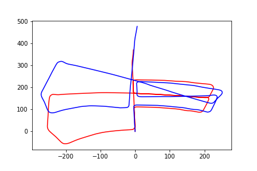
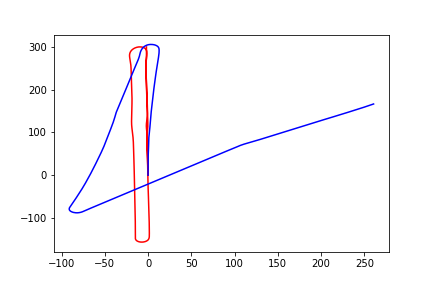
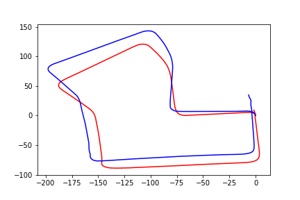
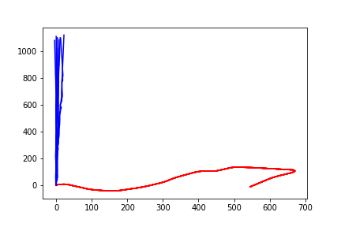

# DeepVO
* Unofficial PyTorch Implementation of [DeepVO: Towards end-to-end visual odometry with deep Recurrent Convolutional Neural Networks](https://ieeexplore.ieee.org/document/7989236/)
* Pretrained FlowNet weights from [ClementPinard/FlowNetPytorch](https://github.com/ClementPinard/FlowNetPytorch)
* RAdam Optimizer from [LiyuanLucasLiu/RAdam](https://github.com/LiyuanLucasLiu/RAdam)
* Midterm for ECE471 Deep Learning Cooper Union
# Results
### Training Sequence
* sequence 00 \
-
* sequence 02 \
-
* sequence 08 \
-
* sequence 09 \
-
### Test Sequence
* sequence 01 \
-
* sequence 03 \
-
* sequence 05 \
-
* sequence 06 \
-
* sequence 07 \
-
* sequence 10 \
-